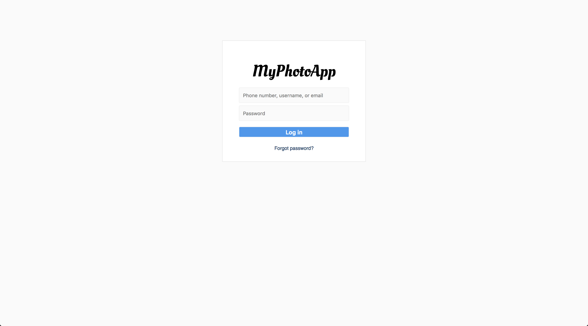
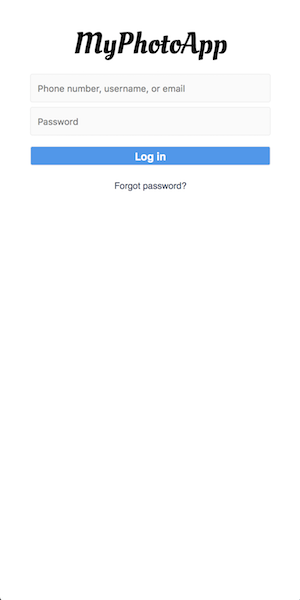

# Assignment 1: Login Page

Your goal in this assignment is to create a login page for your brand new photo sharing app, "MyPhotoApp" (you don't have funding yet and so can't hire a branding consultant).

Here's what the page should look like:

On small screens (less than 450 pixels), it should look like this:

Some suggestions as you get started:

1.  The goal is not to draw inspiration from these mocks. You should try to recreate them as close as possible to the original, including colors, fonts, spacings, and so on.
2.  You can extract colors from images using the Digital Color Meter in your Applications/Utilities folder on OSX.
3.  Here's a link to the font used for the large text: https://fonts.google.com/specimen/Oleo+Script. The smaller text is just the default sans-serif font in Chrome.

Good luck!
