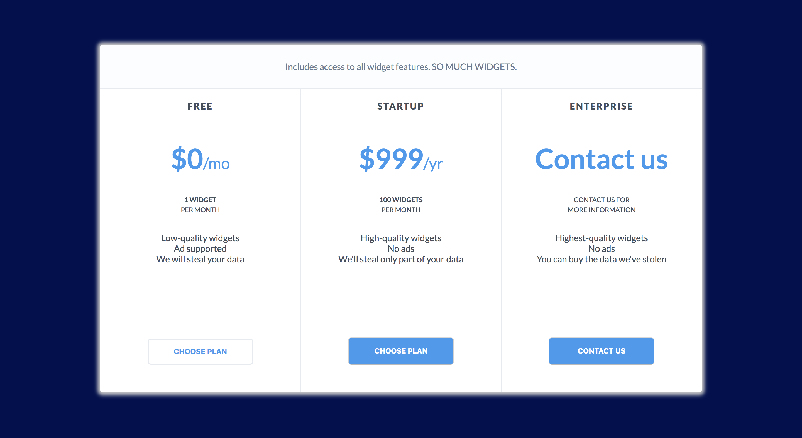

# Assignment 2: Pricing Chart

Your goal in this assignment is to create a pricing comparison chart for your brand new widget app (inspired by [Mixpanel](https://mixpanel.com/pricing/)).

Here's what the page should look like:

When you hover over any one of the tiles, the text should change (WITHOUT USING JAVASCRIPT). Here's what this looks like if you hover over the first tile:

Here's a GIF to show how the chart changes as the mouse moves:

Some suggestions as you get started:

1.  Make sure to git rid of the default browser outline when you click on a button! That blue fuzzy outline is nonsense.
2.  Try to start general and get more specific. One suggested approach: first create the large white box on the dark background. Then create the header. Then create the three cards. Then focus on copy and making styling more consistent. Leave the transitions for the end.
3.  Here's a link to the font used: https://fonts.google.com/specimen/Lato.

Good luck!
