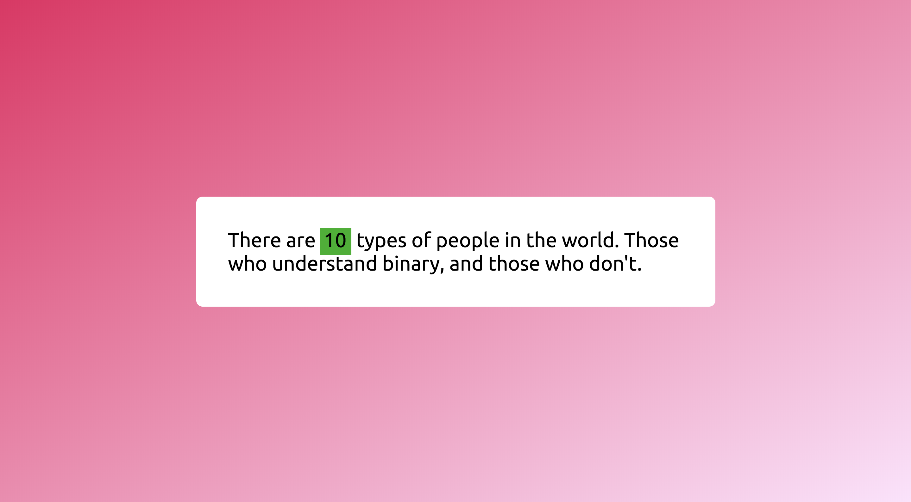
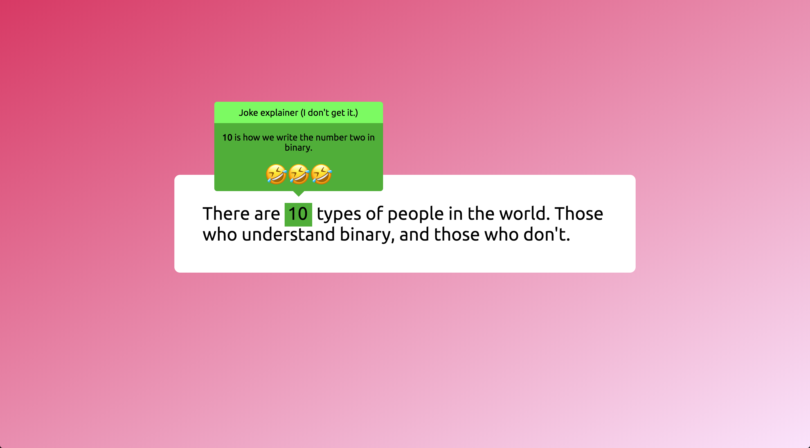

# Assignment 3: Tooltip

Your goal in this assignment is to create a tooltip! This particular tooltip will explain a classic programming joke to friends of yours who may not be hip to binary numbers.

Here's what the page should look like:

When you hover over the the number "10", the tooltip should appear (USING ONLY CSS) above the number with an explanation of what the joke means. Here's what that should look like:

Here's a GIF to show the process of the tooltip appearing and disappearing.

Some suggestions as you get started:

1.  The font has been provided to you in the HTML.
2.  Positioning will be your greatest ally (but also potentially your greatest challenge).
3.  The arrow shape at the bottom of the tooltip can be made purely with CSS. If you have an idea of how to do this, great, but honestly, whenever I need to make this shape, I have to google it. Try to google around for an answer, it's a good exercise in thinking about what keywords to search for. If you're really struggling, [this](https://stackoverflow.com/questions/12610409/tooltip-with-a-triangle) should provide you with what you need.

Good luck!
